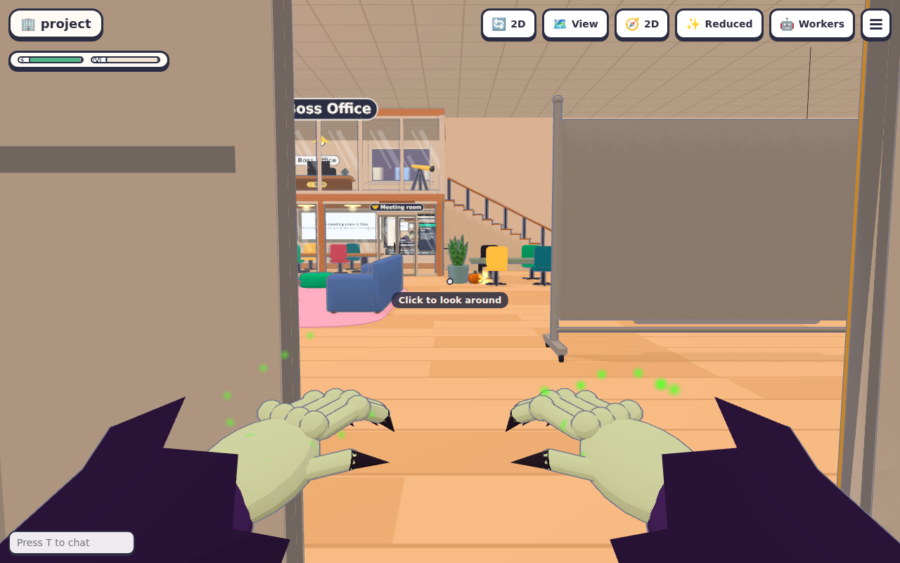
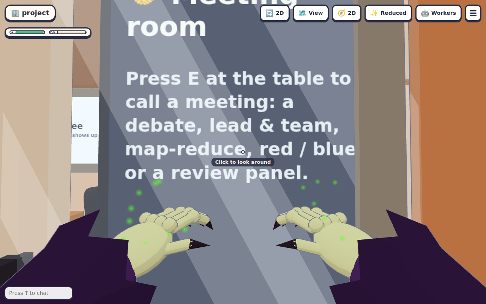
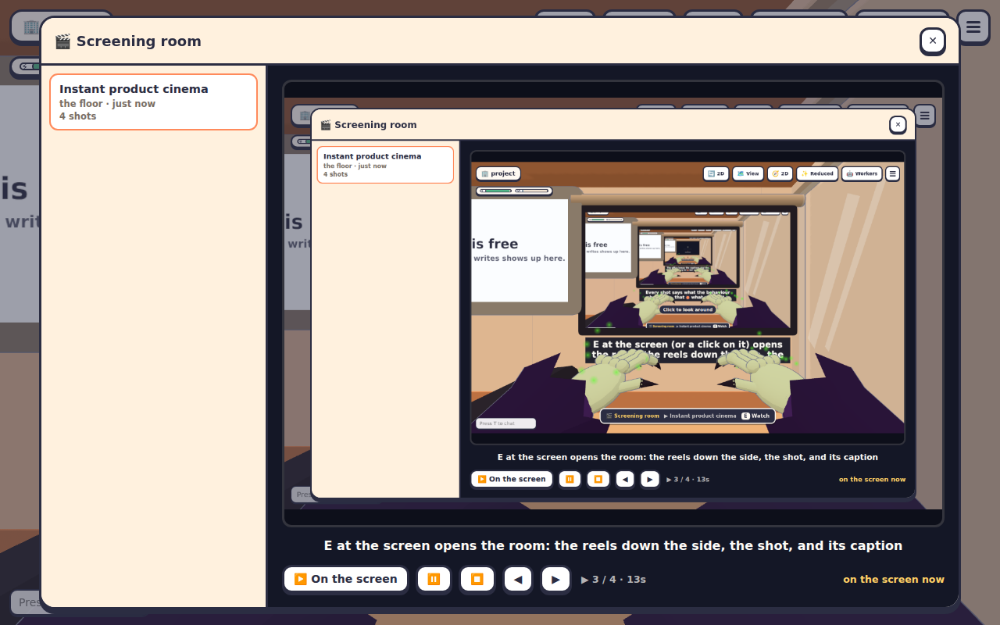
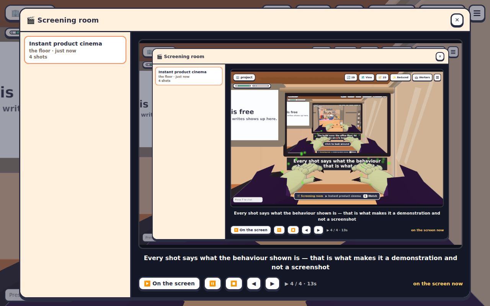

# The screening room

Back to the [README](../README.md), or see [Features](features.md) for the short version.

When a worker finishes a feature, the office can show what it actually does instead of a description of
it. The worker records a short demonstration against the build — a screenshot per step, each one
captioned — and puts it on the screening room's screen, where everyone on the floor watches the same
shot at the same moment.

- [What a reel is](#what-a-reel-is)
- [Recording one against the build](#recording-one-against-the-build)
- [The screening room](#the-screening-room)
- [Everyone watches the same shot](#everyone-watches-the-same-shot)
- [How it is kept](#how-it-is-kept)
- [What each file does](#what-each-file-does)
- [Controls](#controls)
- [Limits, and what's deliberately left out](#limits-and-whats-deliberately-left-out)

## What a reel is

A **reel** is a handful of pictures of the build with a caption on each:

```json
{
  "title": "Instant product cinema",
  "pr": 99,
  "shots": [
    { "caption": "E at the screen opens the window", "key": "KeyE", "wait": 800 },
    { "caption": "The window shows the build's own picture", "click": ".cinema-reels", "wait": 600 }
  ]
}
```

Two rules, both enforced by the office:

- **It is the actual build.** A shot is a PNG the worker captured of the running client — not a mock-up,
  a drawing or a description. `scripts/record-reel.mjs` drives a real browser against `dist/public`.
- **Every shot is captioned.** A reel with an uncaptioned shot is refused. The caption says what the
  behaviour in that picture *is*, which is the whole point of the room: someone who was not there can
  watch what shipped and know what to look at.

At most twelve shots, at `SHOT_MS` (3.2 s) each, so a reel is a demonstration rather than a video. A
floor keeps the ten newest (`REELS_KEPT`); the eleventh takes the oldest with it.

## Recording one against the build

The recorder runs the office from source and its **production bundle**, drives Chromium over it, and
screenshots after each step:

```bash
npm run build
npm run reel:record -- --reel reel.json --out reel-staged.json
office-workers cinema add < reel-staged.json
```

It finds Chromium the way the other browser harnesses do (`CHROMIUM_PATH`, else the Playwright download
under `~/.cache/ms-playwright`), and signs the page in before it loads, because a page loaded signed out
has no socket to connect with. A step may `goto` a path, `click` a selector, `key` a code, `type`, or
`evaluate` a snippet; `wait` is how long to settle afterwards. Anything optional but the caption.

To record against an office that is already running — the one you are working in, or a deployment —
give it that address and its password, and the recorder leaves your own office alone:

```bash
npm run reel:record -- --reel reel.json --start http://127.0.0.1:4600 --login "$OFFICE_PASSWORD"
```

`office-workers cinema add` is the other half: it reads the reel on stdin, reads each picture off disk
and sends the bytes with it, so the office never reads the agent's disk and the whole reel is one JSON
body. An agent with MCP has the same thing as the `cinema_add` tool.

## The screening room

The screen hangs on the meeting room's far wall, beside the board: the one room in the office people
already sit down in to look at something together. A projector stands beside it, and the caption plate
hangs under the screen so what is being said is on the wall too.

**E** at the screen opens the window: the floor's reels down the side, and the one you are watching
beside them. A new reel goes up as it arrives, and **▶️ On the screen** puts any reel up for everyone.
The controls mirror what the wall is doing, so a room's screen can be paused, turned off, or stepped a
shot along from the window. Every modal has its ✕, and **Esc** puts you straight back to looking
around with no extra click.

## Everyone watches the same shot

The same trick the jukebox and the TV use, with a step instead of a scrubber:

```ts
CinemaState = { reels, on, reel, frame, playing, at }
```

`frame` is the shot everyone is on, `playing` whether it's running, and `at` when that was true on the
office's clock. Each browser works out the shot it must be showing from those and `store.officeNow()` —
`(frame + ⌊(now − at) / SHOT_MS⌋) mod shots.length` — and drifts by nothing, because nothing is sent.
So a reel change, a play or a pause costs one websocket message, and the rest of the reel costs
nothing at all.

Nothing video-shaped crosses the wire: the office keeps a caption list and a folder of PNGs, and each
browser fetches the one shot it needs (`GET /api/cinema/shot?floor=&reel=&n=`) as it comes to it.

## How it is kept

One `Cinema` per floor, in its own checkout's `.agent-office`: `cinema.json` (mode `0o600`) with the
reels and the screen, and `cinema/<reel id>/0.png`, `1.png`, … beside it. Folder names are twelve hex
characters the office makes itself, so no picture folder is ever named from outside.

A restart brings back what was on. A reel whose pictures have gone is **forgotten** rather than left
listing shots with nothing behind them, and the pictures of a reel the floor has dropped are deleted
with it (`Cinema.forget`). The reels are files on the floor's own disk, like the whiteboard's, so a
floor hosted on someone else's machine refuses the room by name rather than pretending to have it.

## What each file does

| File | Piece |
| --- | --- |
| `src/shared/cinema.ts` | `ReelSummary`, `CinemaState`, `frameAt` (who's on which shot), `showing`, the limits — one source of truth for both sides |
| `src/server/cinema.ts` | `class Cinema`: the reels, the screen, the PNGs, the restart, and what a reel takes with it when it goes |
| `src/server/ws/handlers/cinema.ts` | `cinema.play` / `.pause` / `.stop` / `.remove`, the toast, and the piece of `FloorView` a floor is entered with |
| `src/shared/protocol/cinema.ts` | The four messages and the one the floor sends |
| `src/server/http/routes/cinema.ts` | `GET /api/cinema/shot` — one shot's PNG, served like the whiteboard's |
| `src/server/office-workers.ts` | `readReelRequest`, `checkPng`, `pngSize`: what a reel an agent sent has to be |
| `src/server/floor.ts`, `office/floors.ts` | One `Cinema` per floor; the hook route an agent's `cinema add` arrives on |
| `bin/office-workers.js` | `office-workers cinema add/list/remove`, `readReel`, and the `cinema_add` MCP tool |
| `src/client/features/cinema/index.ts` | `installCinema`: the interaction at the screen, and what paints the wall each frame |
| `src/client/features/cinema/world.ts` | The fixture: the screen, its caption plate, and the projector |
| `src/client/features/cinema/screen.ts` | `ScreenPainter`: the shot and its caption, painted onto the two meshes as textures |
| `src/client/features/cinema/ui.ts` | The window: the reels down the side, the shot and its caption, the controls |
| `src/server/cinema/record.ts` | The recorder itself: reads the reel file, and walks it in a real browser over the real build, one screenshot per step |
| `scripts/record-reel.mjs` | The command over it: `npm run reel:record` |
| `scripts/record-cinema-reel.mjs` | How this page's own pictures were made: films this feature against an office already showing it |
| `tests/cinema.test.ts` | The limits, the reader, `class Cinema` across a restart, and the CLI |
| `scripts/e2e-cinema.mjs` | The whole thing in a browser: record a reel against the build, and watch it land |

## This page's own reel

The pictures in [`docs/cinema-evidence/`](cinema-evidence/) are this feature's reel, filmed the way a
worker's would be: `scripts/record-cinema-reel.mjs` brings up an office that already has the committed
reel on its screen, walks this feature in front of it with the same recorder, and writes the shots
beside it. Re-run it with `npm run build && node --import tsx scripts/record-cinema-reel.mjs`.

| Shot | What it shows |
| --- | --- |
|  | The build running: the office floor, its desks and its boards |
|  | The screen with a recorded reel on it and the caption under it |
|  | **E** at the screen: the reels down the side, the shot, its caption |
|  | The caption plate under the screen, saying what the shot shows |

## Controls

- **E** at the screen in the meeting room opens the window.
- In the window: **▶️ On the screen**, **⏸️**, **⏹️**, and **◀ ▶** to step a shot along; **✕** or
  **Esc** closes it.
- `office-workers cinema list` says what is on the screen and what else the room has;
  `office-workers cinema remove <id>` takes a reel off the floor.
- The hint bar over the screen says what is showing before you press anything.

## Limits, and what's deliberately left out

- **Pictures, not video.** A reel is a run of stills. It cannot show a drag, a scroll or anything
  between two frames, and a reel of a moving feature reads as a slideshow. The obvious next step is
  short screen recordings (WebM, which the TV already plays) with the same captions timed to them; the
  recorder is already the thing that would capture them.
- **A demonstration is only as good as its captions.** The office can insist there is one; it cannot
  know the picture shows the feature rather than an error dialog. The shots are recorded before the
  reel is sent, so a worker should watch its own reel first.
- **No re-recording.** A reel's pictures never change, which is why the shot route is `immutable`; to
  put a fixed demonstration up again, record it again and add it as a new reel.
- **A hosted floor has no screening room.** Its reels would be pictures on someone else's disk, which
  the office must never read, so the room refuses by name there — exactly as the whiteboard does. The
  obvious next step is letting the host serve its own shots over the floor socket, which is the
  measurement in [remote agents](remote-agents-plan.md#finding-10) that hasn't been taken.
- **The screen shows one reel at a time**, like the TV. A second screen would be its own wall space,
  and the walls in the meeting room are spoken for.
