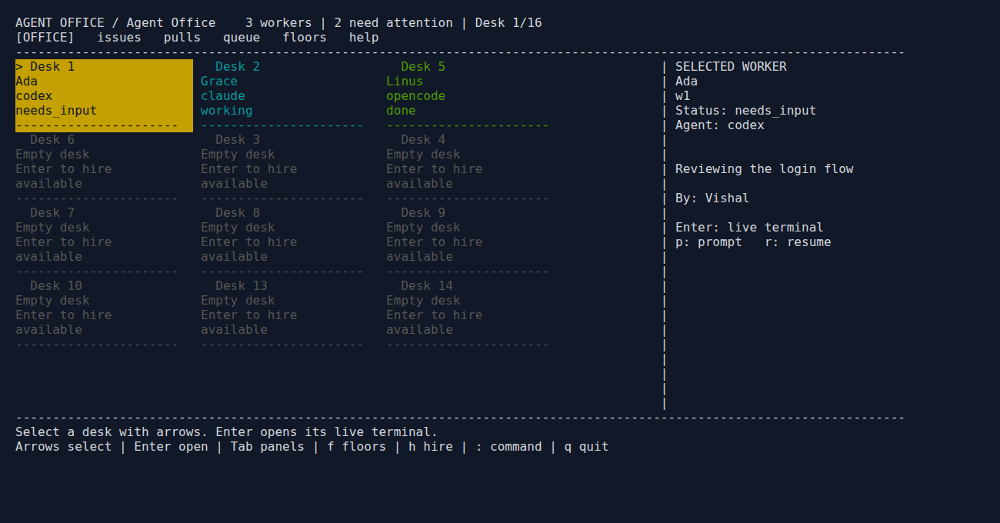

# Terminal office

For shell commands, flags, dashboard keys and Cloud Shell restart instructions, see [cmd.txt](../cmd.txt).

The CLI is a third view of the same office, alongside 3D and `/lite`. Run the server first, then join it in another terminal:

```sh
agent-office --no-open
# In another terminal:
agent-office tui
```

Enter the office password at the hidden prompt. If `AGENT_OFFICE_PASSWORD` is set, the client uses it instead. Passwords and session cookies are never saved by the client. With an individual account, use `agent-office tui --name ada` and enter that account's password.

For a remote office use `agent-office tui --office https://office.example.com`. An existing SSH tunnel works with the default `http://localhost:4600`. TLS certificates must be trusted by Node; self-signed offices need their certificate installed as a trusted CA (for example through `NODE_EXTRA_CA_CERTS`).

After login, the office fills your terminal with a live desk grid. Workers are colored by status: yellow needs input, green is done, cyan is working. The selected desk is highlighted. Empty desks remain visible and Enter opens hiring there. Larger terminals show the selected worker's details beside the grid; smaller terminals page through desks as you move.

| Key | Action |
| --- | --- |
| Arrow keys | Select desks or scroll a board |
| Enter | Open a worker terminal, hire at an empty desk, or enter a selected floor |
| Tab / Shift+Tab | Cycle panels |
| `f`, `i`, `b`, `t`, `m` | Floors, issues, PRs, task queue, worker messages |
| `n` | Next worker needing input or finished |
| `h`, `p`, `r` | Hire, prompt selected worker, resume selected worker |
| `x` | Open send-home choices: arrows or 1/2/3 select cleanup, Enter confirms, Esc cancels |
| `c` | Write a chat message |
| `:` | Open the command prompt |
| Esc | Cancel the prompt or return to the desk grid |
| `?` | Help |
| `q` / Ctrl+C | Leave the dashboard |



Type commands after pressing `:`:

| Command | Action |
| --- | --- |
| `floors`, `go <id or name>` | List and switch project floors |
| `workers` | List IDs, names, statuses and current activity |
| `hire codex <prompt>` | Hire at an empty desk on the current floor |
| `attach <worker>` | Open the shared live terminal; Ctrl+] returns to the office |
| `prompt <worker> <text>` | Send the worker a prompt |
| `resume <worker>` | Resume a stopped worker |
| `home <worker> [--cleanup auto\|keep\|worktree\|all]` | Open send-home choices (Keep both selected); explicit cleanup skips the chooser |
| `pr <worker>` | Ask the office to push and open the worker's PR |
| `messages [request-id]` | Read tracked worker requests and replies; Enter opens a thread |
| `issues`, `pulls`, `queue` | Read the current boards and queue |
| `enqueue <text>` | Add a task to the existing queue |
| `chat <text>` | Send chat to teammates |
| `help`, `quit` | Show help or leave the client |

Worker commands accept an exact ID or a single-word name. Use IDs for names with spaces or duplicate names. The hire providers are `claude`, `codex`, `opencode`, `grok`, `muse`, `dsh` and `custom`. Hiring uses the floor's shared checkout; queue tasks follow the office's existing queue rules.

Workers using a shared checkout show deletion choices as unavailable and keep the checkout and branch when sent home. Meeting checkout cleanup is managed by the meeting.

Terminal input, including Ctrl+C, goes to the attached worker. Ctrl+] detaches. Resizing your terminal resizes the shared worker terminal for all viewers. Outside attachment, `q` or Ctrl+C exits the client. Esc returns to the desk grid; while attached, Esc goes to the worker like other terminal keys. Exiting leaves the server and workers running. If disconnected, rerun the command to sign in again.

This first CLI view requires an interactive terminal and an existing project floor. Add floors using the browser office. Voice, whiteboards, spatial activities and account administration remain in the existing interfaces.

Tracked worker message commands and receipts are described in [communications.md](communications.md).
