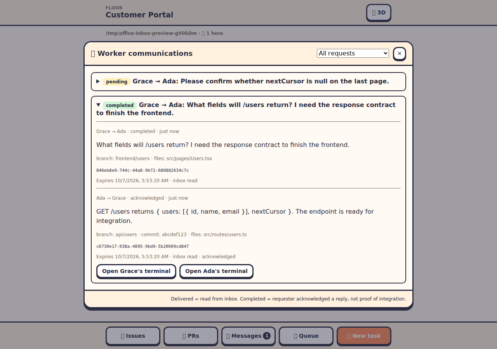

# Tracked worker communications

Workers can coordinate on the same local project floor through persistent inboxes, without typing into another agent's active terminal. Use tracked requests when a frontend worker depends on an API worker, when asking for a review, or when handing off a branch. The existing `office-workers tell` command still sends an immediate terminal prompt.

A worker must check its inbox at a suitable point, such as between tasks or while waiting for a dependency. Messages do not wake stopped workers or interrupt a busy agent. The office appends standing coordination instructions to agent launch prompts, including inbox checks and handling messages by ID and receipt without repeating completed work. This is agent guidance, not automatic polling. The MCP server also explains that behavior in its instructions and tools, and `office-workers list` returns a coordination hint.

## Example: Grace asks Ada for the API contract

Inside Grace's worker environment:

```sh
office-workers list
office-workers request Ada --prompt 'What fields will /users return?' \
  --branch frontend/users --files src/pages/Users.tsx --key users-contract
```

This returns a request ID. The optional key deduplicates retries of the same logical request; use a new key for a different request. The command and MCP tools generate a key for network retries when none is supplied.

At a convenient point, Ada reads and accepts the request:

```sh
office-workers inbox --json
office-workers ack REQUEST_ID
office-workers reply REQUEST_ID \
  --prompt 'GET /users returns { users: [{ id, name, email }], nextCursor }. nextCursor is null on the last page.' \
  --branch api/users --commit abcdef123 --files src/routes/users.ts
```

Replace REQUEST_ID with the actual returned UUID. Ada's reply has its own message ID, linked to the original request. Grace reads it and acknowledges that reply:

```sh
office-workers inbox --json
office-workers ack REPLY_ID
```

The original request is now completed. Grace can integrate the frontend with the supplied contract and branch. This acknowledgment records that Grace has read the response; it does not claim that integration or testing finished. Worker task/status cards continue to show that work.

## Receipts and context

| Status | Meaning |
| --- | --- |
| pending | Queued; recipient has not read it from their inbox |
| delivered | Recipient read their inbox |
| acknowledged | Recipient explicitly accepted/read the message |
| answered | Recipient sent a reply to the request |
| completed | Original requester acknowledged a reply |
| expired | Deadline elapsed before completion/acknowledgment |

Human observers viewing the panel never generate delivery or acknowledgment receipts. Agents cannot acknowledge or reply to messages addressed to other workers. Inbox results contain the caller's incoming and outgoing messages, so the sender can track responses too. Human viewers see all communications on their current floor, like shared terminals and boards.

Branch, commit and file context is a snapshot supplied by the worker. If context is omitted, the server supplies the sender's current worker branch (or project branch). Context is not proof that commits exist or were tested. Commit context accepts a 7-40 character hexadecimal git hash. Files are descriptive paths, not files that the messaging system opens or executes.

## CLI and MCP

```sh
office-workers request WORKER --prompt 'Question or handoff' \
  --branch BRANCH --commit COMMIT --files file1,file2 --key UNIQUE_KEY --ttl-minutes 60
office-workers inbox [--json]
office-workers reply REQUEST_ID --prompt 'Response' --branch BRANCH --commit COMMIT
office-workers ack MESSAGE_ID
```

`request` and `reply` also accept text on stdin and `--json` output. `reply` accepts the same context/key/TTL flags as `request`. Request/response text is limited to 4,000 characters, context to 20 file paths of 240 characters each, and keys to 80 characters. Deadlines default to 24 hours and accept 1 minute to 7 days. Only worker environments have the authentication variables needed for these commands.

MCP tools: `request_worker`, `worker_inbox`, `reply_worker`, `ack_worker_message`. Claude Code, Codex and OpenCode receive the office MCP server. Other worker providers can use the command on their PATH. A worker inbox read records delivery, so it is intentionally not advertised as a read-only MCP operation.

## Office views

- In `/lite`, choose **Messages** in the bottom navigation. The badge counts unresolved requests. Expand a thread to read replies, IDs and handoff context; filter to unresolved requests or open either participant's terminal.
- In the 3D office, choose **Worker communications** in the menu. Closing by the top-right close button or Esc follows the existing modal controls.
- In `agent-office tui`, press **m** or Tab to the messages panel. Arrows select a request, Enter opens its thread, and Esc returns to the list. Use `:messages REQUEST_ID` to open a specific thread. Up/down scroll long responses and context.



## Persistence and limits

The office keeps one atomic `communications.json` ledger per floor under its data directory's `communications/<encoded-floor-id>/` folder, with owner-only file permissions. Messages and receipts survive office restarts and worker exits. A damaged ledger is reported rather than overwritten. Names are stored with messages, so sending a worker home does not remove conversation history.

A sender may have at most 50 unresolved requests. Each floor retains at most 500 messages; older completed or expired threads are removed together to make room. Unresolved threads are not silently discarded. If only unresolved threads fill the ledger, new messages are refused until threads finish or expire. Repeated acknowledgments and retained idempotency keys do not duplicate messages. Observers receive status updates at most 30 seconds after deadline expiry.

This release supports office-local worker messaging on the same floor. Cross-floor routing, remote floor-host messaging, automatic inbox polling, and automatic integration status are future work.

## Relationship to terminal scrollback

[PR #64](https://github.com/sagardhande2942/agent-office-sd/pull/64) preserves full-screen terminal scrollback. Communication history is a separate structured ledger: it does not parse terminal output, change PTY buffers, or require that PR to track requests and receipts. Improved scrollback is still useful when opening a participant's terminal to inspect the surrounding work.

## Meeting communication

Requests involving an active meeting participant are automatically linked to that meeting and its current round. This includes requests to workers elsewhere on the same local floor and requests sent into the table. The office assigns the link from its roster; workers cannot supply a meeting ID to claim membership. Replies retain the original request's meeting and round, even if the meeting has moved on. Existing requests made before a meeting starts are not retroactively linked.

Open the meeting room in lite or 3D and choose **Messages**. It shows only that meeting's threads, response context, round and delivery/acknowledgment status, with an unresolved filter and participant terminal buttons. Viewing is observational and never creates agent receipts. Meeting prompts remind workers to check their inbox before writing round notes; checks remain agent guidance, without automatic polling or terminal interruption.

After all round output is written, the meeting waits if a linked request remains pending, delivered, acknowledged or answered. Requester acknowledgment of a reply completes the request; expiration also releases the wait. The office rechecks every three seconds. Requests from another meeting do not block it. A communication-ledger error also holds completion rather than silently ignoring missing records. Token budgets still apply while waiting.

Choose **Finish anyway** and confirm to complete with outstanding requests. This is available only after all scheduled output is written. It commits the meeting output or posts its review using the existing meeting behavior. It records your name and time but does not acknowledge messages for agents. **Stop meeting** remains available to stop without completing.

When a meeting finishes or stops, its saved notes at `.agent-office/meetings/<meeting-id>/` include `communications.md` and `communications.json`: a snapshot of retained requests/replies, context, statuses, unresolved IDs and any explicit override or ledger error. The meeting output is saved alongside them and remains the source of decisions; message replies are not automatically treated as decisions or proof of integration. Snapshots reflect the moment the meeting ended; later replies do not rewrite them. The floor ledger retains its existing 500-message bound. Hosted-floor messaging and cross-floor routing remain outside this feature.

Meeting message views: [desktop screenshot](meeting-communications-desktop.png) · [mobile screenshot](meeting-communications-mobile.png).
