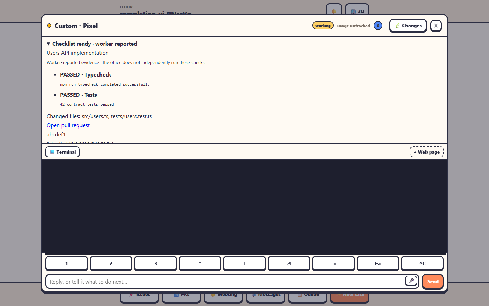

# Worker completion checklists

A terminal becoming ready means its turn ended. A completion checklist records what the worker says it delivered and checked. It does not independently verify tests, commits, files or a PR, and does not merge, publish or mark a queue task finished.

## Submit from a worker

Read the current task revision:

```sh
office-workers completion --json
```

Then submit JSON, using the returned revision:

```sh
office-workers complete --json <<'EOF_REPORT'
{
  "revision": 1,
  "summary": "Implemented the users API and documented its response format.",
  "checks": [
    { "name": "npm test", "status": "passed", "evidence": "42 tests passed; command exited 0." },
    { "name": "Browser verification", "status": "skipped", "evidence": "API-only change; exercised the route in integration tests." }
  ],
  "files": ["src/routes/users.ts", "tests/users.test.ts"],
  "pr": "https://github.com/YOUR_ACCOUNT/YOUR_REPO/pull/123",
  "commit": "abcdef123"
}
EOF_REPORT
```

Use actual results and your actual PR URL/hash. Each check needs a name, status (`passed`, `failed`, `skipped`) and evidence; skipped checks need a reason. A failure makes the checklist **Needs attention**. A checklist with no failed checks is **Ready · worker reported**, including explicitly justified skips. Ready means the checklist is supplied, not independently verified or approved.

Provide `files: []` and `filesNote` for work without file changes. Supply `prNote` instead of `pr` when a PR is not applicable or not ready. A checklist does not authorize publishing; follow your project's repository rules. `pr` must be an HTTPS URL without credentials. `commit` is optional and accepts a 7–40 character hexadecimal hash. The server supplies the branch and task snapshot where available.

`complete` reads a JSON object from stdin; `--json` is accepted and responses are JSON. If revision is omitted, the command reads the current revision immediately before submission. Include an explicit revision for a report prepared earlier so the server can reject it if the task changed. MCP tools are `worker_completion` and `submit_worker_completion`; MCP submissions require an explicit revision.

## Office views and lifecycle

- Lite worker cards show **Checklist missing**, **Checklist ready · worker reported**, or **Checklist needs attention**.
- Open a worker terminal in lite or 3D and expand its completion checklist to inspect results, changed files, PR context, branch/commit and submission time. The existing terminal close button and Esc controls apply.
- The CLI office shows the checklist status and evidence in selected-worker details. Worker-list JSON includes the report.
- Finished queue tasks retain a snapshot of the report available when the worker's turn ended, including after the worker goes home or the office restarts. Open the queue board and expand the task's checklist. Requeuing creates a fresh attempt without the old report. Later worker submissions do not rewrite a finished task's snapshot.

A new substantive prompt or a cleared/replaced conversation invalidates the worker's current checklist and increments its revision. Continuation and bare slash commands do not start a new checklist. Reports persist in the local worker state until replaced or the worker leaves; queue snapshots persist until the task is forgotten. Reports are self-reported snapshots: the office does not monitor subsequent filesystem changes to verify their continued accuracy.

Workers receive completion guidance in their launch prompt and MCP instructions. Claude Code and Codex native Stop hooks request one continuation when a regular task has no checklist or has failed checks, while guarding against stop-hook loops. Helpers, meeting seats and board agents are exempt from this stop reminder. Other providers use the standing guidance and CLI/MCP submission. The reminder is advisory, not an infinite completion lock; idle status or an empty queue alone still does not prove success. Launch/resume workers to load updated instructions. Completion submission currently requires a local floor.

Limits: summary 2,000 characters; 1–30 uniquely named checks (names 240 characters, evidence 2,000 each); up to 100 file paths of 500 characters; explanatory notes and PR URL 1,000 characters each. Evidence is displayed as text and never executed.


