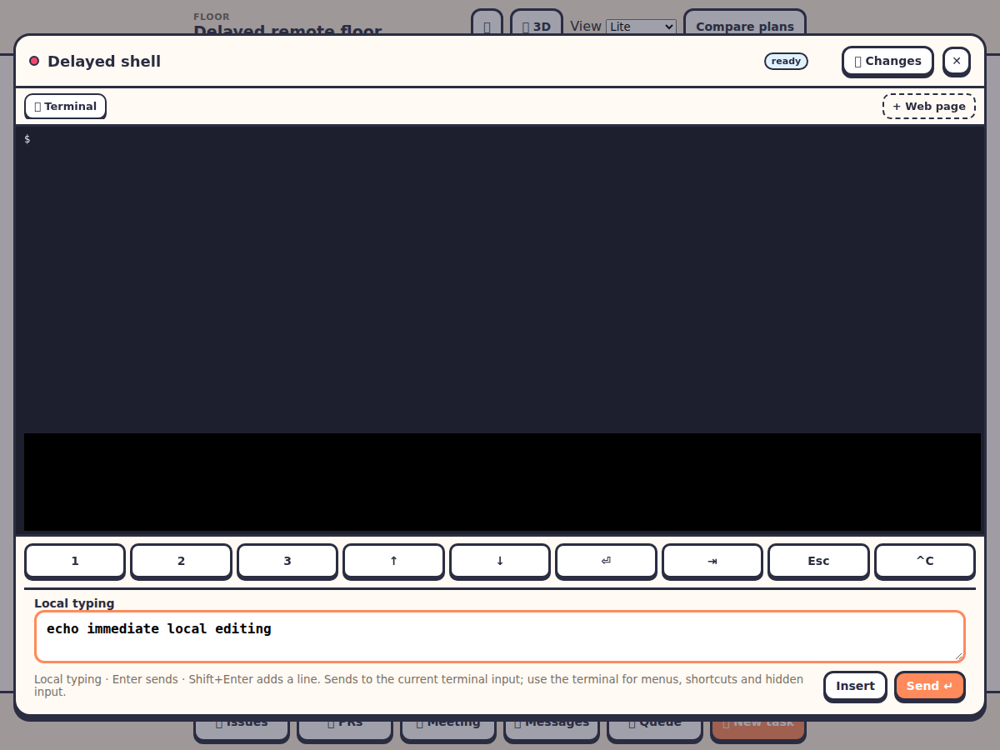

# Floor hosts: running a floor on someone else's machine

Back to the [README](../README.md). The engineering plan is
[remote-agents-plan.md](remote-agents-plan.md).

A **floor host** lets one machine serve a floor for an office running on another. Everyone still joins
the *same* office — one address, one chat, one set of boards — and a floor whose checkout lives on
your laptop runs there, as you, on your disk, with your sign-ins.

The laptop dials the office. Nothing listens on your machine, and nothing inbound is needed: no port,
no firewall change, no NAT traversal.

A hosted floor does not need a repository name in its saved definition to hire workers. Its agent
choices come from the connected host; a demo checkout without a repository uses its floor name.

Terminal output reaches attached viewers, and room and worker updates reach people on the hosted
floor. Changes previews go only to the viewers watching them. When a host disconnects or leaves a
floor, pending calls stop waiting immediately. Restart `agent-office floor-host --office <address>`
to reconnect with its saved token; the floor becomes reachable when the host announces it ready.

> **Status: a machine pairs, connects, runs a real floor, answers calls against it, and the floor
> appears in the elevator with its machine's name and whether that machine is answering.** Riding
> into one works: the floor is a real room you can walk into, with the machine's name on its door.
> See [what is not done](#what-is-not-done) for the parts that are still missing.

## Pairing

Admins can take a hosted floor off the building using its trash button in **Elevator**, even while
the host is offline. The row disappears for all viewers without restarting the office, and anyone
on that floor moves to another floor or the lobby. The host's checkout is retained. After updating
an older office that left a deleted floor in the list, use Delete again to clear the stale row.

### Quick connect from the UI

1. Keep the office running (including `npm run dev`). For ngrok, run `ngrok http 4600` in another terminal.
2. Open **☰ → Connect your floor**. As an admin, click **Generate pairing code** and give the code and public office URL to the joiner. Codes expire after 30 minutes and are single use.
3. The joiner opens that same UI, enters the code, public URL, and **their own local project folder**, then clicks **Copy join command**. The UI offers PowerShell and Bash quoting. The host never needs to know the folder layout.
4. The joiner runs the command from their agent-office folder after `npm install` and `npm run build`. Keep it running; the project appears in the elevator immediately. Workers run on the joiner's machine, using its agent and forge sign-ins.

The browser helps prepare the command; a process on the joiner's machine is still required to read
the project and run agents. Everyone in the office can control those terminals. Only pair with an
office you trust. No extra ngrok tunnel or inbound port is needed on the joiner's machine.

The equivalent joiner command is:

```powershell
node bin/agent-office.js floor-host --office "https://YOUR-NGROK-URL" --code "PAIRING-CODE" --checkout "C:\my-project"
```

`--checkout` is the exact existing project folder on the joiner's computer. Its repository name is
read from its Git `origin` remote; add `--repo OWNER/REPO` if it cannot be detected (for example a
private Git service or a folder without a remote). `--floor "Display name"` optionally names the
floor. The office registers it during authenticated pairing and saves it in the building; no office
restart or `hosts add-floor` is required. A repository already assigned to another machine or path
is refused rather than moved. Reconnecting the same machine and path reuses its floor.

The office address, token, and project are saved locally. To reconnect later:

```powershell
node bin/agent-office.js floor-host
```

If this same office's ngrok URL changes, reconnect with `node bin/agent-office.js floor-host --office "https://NEW-URL" --same-office`.


If reconnect says the repository already has a floor after your saved token was lost or replaced, stop the machine's floor host. The office admin opens **Connect your floor**, finds the original offline machine under **Paired machines**, and clicks **Reconnect this machine**. Enter the joiner's original checkout path and share the generated command with them. It includes `--recover` to replace the incorrect saved credential while preserving the original machine and floors. Future reconnects use `node bin/agent-office.js floor-host` without a code.

This explicitly sends the saved token to that new address; use it only for the same trusted office.
For a different office, use a fresh `--code` and `--checkout`. Credentials otherwise stay scoped to
the saved office address. Use `--config` for separate office connections.
Update both the office and joiner to use this flow; older offices cannot register `--checkout`.

### Manual pairing

On the **office**:

```bash
agent-office hosts pair --name "Alice's laptop"
```

That prints a code, valid for 30 minutes and good once. Give it to whoever is bringing the machine.

On **their** machine:

```bash
agent-office floor-host --office wss://the-office.example --code FB9N-0HA3 --name "Alice's laptop"
```

The `--code` is only for the first time. The office answers with a **token**, which the machine keeps
at `~/.agent-office-floor-host.json` in mode `0600` and reuses. Nobody carries a token between
machines, and the office keeps only a hash of it — a copy of its `hosts.json` admits nobody.

After that:

```bash
agent-office floor-host --office wss://the-office.example
```

The address is whatever reaches the office: `ws://localhost:4600` for a local one, or the tunnel's
hostname if it is behind one. `http`/`https` are accepted and turned into `ws`/`wss`.

## Managing machines, on the office

```bash
agent-office hosts                     # what is admitted, and whether each is connected
agent-office hosts seats <name> 4      # how many workers it will seat across its floors
agent-office hosts accept <name> on    # whether an automation hire may seat there
agent-office hosts revoke <name>       # end it
```

`accept` is the only place a person and a robot differ. **A person may always hire onto any machine.**
A queue task or a board agent — a stranger's prompt arriving by automation — may only hire onto a
machine whose owner has turned `accept` on. Every refusal is about capacity or kind and names the
machine: *"Alice's laptop has no free desk"*, never anything about who is asking.

`revoke` is total and immediate. The token stops working at the next connection, every floor that
machine carried goes offline at once, and pairing again makes a **new** machine rather than reviving
the old one — so revoking is not something undone by accident.

## What hosting a machine means

**There is no container isolation.** A worker on a hosted floor runs as you, on your machine, with
your environment. Everyone in the office can type into its terminal, which means everyone in the
office can reach what you can: `~/.ssh`, `~/.config/gh`, `.env` files, cloud credentials.

That is a deliberate decision, and it is the thing to understand before pairing. The containment is
not a sandbox — it is that **you hold the connection**:

- Close the laptop and the floor stops receiving work immediately.
- `Ctrl+C` the `floor-host` and the same.
- Nothing in the office can reach your machine while that process is not running.

Three features are refused on a hosted floor rather than served, because they are files in the
floor's own data directory and the office must never read a checkout it does not own — the
**whiteboard**, the **dog** and the **docs**. Each says so, and names the machine.

## Whose sign-ins

A hosted floor's workers run on **the host machine's** sign-ins, always. The office does not send its
own, and cannot ask a hosted floor to use them. That is enforced where the floor's context is built:
`runAs` and `forgeAs` are simply not given to it.

Its commits carry its own git identity too, so work from a hosted floor is attributed to the person
whose machine ran it.

## How a floor gets there

On the office, add an existing checkout on a paired machine:

```bash
agent-office hosts add-floor "Alice's laptop" owner/repo --checkout /home/alice/work/owner/repo
agent-office hosts rm-floor owner/repo
```

Stop the office before changing the building with these commands, then start it again and reconnect
the floor host. These commands edit the saved building; they do not update an already running office.
The quick-connect flow above adds the floor live instead; these manual commands remain available.
The checkout stays on the host when its floor is removed. No repository is cloned by `add-floor`.
Use `--floor "Display name"` to name the floor. If `--checkout` is omitted, the path defaults to
`<host projects folder>/owner/repo`. Hosts report that folder on connection, including when they
serve no floors; set it with `floor-host --projects <dir>` (default `~/work`, or `AGENT_OFFICE_PROJECTS`).

The office decides *what* runs on a machine; the machine decides *whether to answer*. `add-floor`
saves a `FloorDef` whose `host` names the paired machine and whose `dir` is the checkout path on it.

The machine is told which floors the office wants when it connects, and serves the ones whose `dir`
exists there. One that does not is skipped and said so, rather than pretended.

## What runs where

A hosted floor is the same `Floor` class the office runs, so nothing about a floor forks for being
hosted. What differs is its **context** — what it can see and what it reports to — and the split is
the point:

| | |
|---|---|
| **Local to the machine** | which agent CLI to run, its arguments, the DSH profile, its own hook endpoint, its own spend ledger, its own prompts. A floor cannot be built without these. |
| **Sent up the socket** | everything the floor would have said to the room: terminal output, status changes, boards, toasts, what a worker changed. |
| **Never given** | `runAs` and `forgeAs` — both per-account **sign-ins**. Their absence is the guarantee that a hosted floor runs on the host's own, and the office has no way to hand it anyone else's. |

One consequence worth knowing: a hosted floor **cannot hold a meeting**, because a meeting needs the
people in the room and the host machine does not know who they are. It refuses by kind, and the
office refuses it too.

## What is not done

Stated plainly, because the alternative is someone finding out the hard way:

| | |
|---|---|
| ~~Riding into a hosted floor is not wired.~~ | **Done.** You can ride to one from the elevator and stand in it. The room is built from the state the host streams up, so the boards, the queue, the plan, the cars and the ball all arrive with you; the dog, the whiteboard and the docs do not, because they are files on that machine, and asking for one tells you so by name. |
| ~~The host does not run a real `Floor`.~~ | **Done.** The host opens a real `Floor` — the same class the office runs — with its own `WorkerManager`, `TaskQueue`, `Forge` and `Changes` on this disk, and answers the office's calls against it. |
| **An agent's office tools are unavailable.** | The host serves `/hooks/*` so a worker's status reaches it, but not the office's `/office/*` MCP endpoints. An agent on a hosted floor cannot use its `office-workers` tools; everything else works. |
| **A machine is not yet told its floors by the office's building list at startup** in every path. | `floorsFor` reads the building, so it is correct for a floor added with a `host`; adding one from the UI is not wired. |

None of these is a design problem — each is a piece of wiring with a named place to land. What is
built is the hard part: the pairing, the socket, the direction, the proxy and the refusals, with the
tests to match.

## In the elevator

A hosted floor is on the panel like any other, and its row says whose machine it runs on:

```
  🖥 Alice's laptop                 💻 2   ← connected
  🖥 Bob's desktop · offline        💻 1   ← machine away
```

Offline is a state, not a failure. The floor and its workers are still there, asleep; it comes back
when that machine does, and **R** resumes whoever was mid-turn. The panel is refreshed when a machine
connects or goes, the same way it is when a worker comes or goes.

A floor whose machine has never paired says *"a machine"* rather than something invented — the
building knows a floor's host id long before anyone claims the code.

## Trying it without two machines

```bash
npm run e2e:floor-host
```

Runs both sides in one process: a pairing code, a token kept at `0600`, a floor served, the machine
going away, and the same machine coming back with its token and no code.

```bash
npm run e2e:floor-ride
```

Starts three real processes — the office, a floor-host on "another machine", and a browser client —
and rides the elevator up to the hosted floor for real. This is the one that would have caught the
bug that made a hosted floor visible and not enterable: the other two wire the registry and the proxy
by hand, so neither could ever reach `floor.go`. It needs no client bundle (`dist/` gets a stub it
removes afterwards, because it only ever speaks `/ws`).

```bash
npm run demo:floor-host
```

Shows the proxy itself: a hire shipped over the socket, a read answered with nothing on the wire, and
every later call refused by name once the machine goes.

## The pieces

| | |
|---|---|
| `src/server/hosts.ts` | the pairing registry, `hosts.json`, and `agent-office hosts` |
| `src/server/floor-hosts.ts` | the `/floor-host` socket and the connected machines |
| `src/server/remote-floor.ts` | the proxy the office holds in place of a `Floor` |
| `src/server/floor-actions.ts` | the surface both satisfy, and why it splits the way it does |
| `src/server/floor-host-cli.ts` | `agent-office floor-host` |
| `src/shared/floorhost.ts` | the frames, the 50 floor cases, and the validators |

## Typing in remote terminals

Remote worker terminals include **Local typing** below the live terminal in Lite, 2D and 3D. Type and edit there to see text immediately in your browser, even when the floor-host connection is slow. **Enter** or **Send ↵** pastes the draft into the terminal's current input and then presses Enter; **Shift+Enter** adds a line. **Insert** pastes without submitting. Existing text in the terminal is kept, so clear it there first if you want to replace it. Multiline text follows the program's normal paste behavior. Use the live terminal/keypad for shortcuts, completion, interactive menus and hidden input.

Drafts remain browser-local until sent, survive closing/reopening the terminal during this page session, and are not saved to disk or shared with other viewers. Sending is disabled until a terminal snapshot arrives or while its worker is offline. Terminal output and direct key controls still travel through the office and floor host; local drafting removes the wait while editing, not network latency after submission.

Update both the central office and `floor-host` CLI for the complete transport improvement: terminal input and resize use ordered WebSocket frames without creating pending requests, timers or acknowledgements, and the host no longer sends eleven unrelated room-state snapshots for every key. The protocol remains compatible with older versions: an old host can still acknowledge the untracked input, and a new host still answers an old office's numbered terminal calls. Keep both updated to avoid the old host's room-state traffic.

Verify with `npm run typecheck`, `npm test`, `npm run build`, and `node --import tsx scripts/e2e-remote-terminal.mjs`. The browser check uses a real office and paired host fixture with a 600 ms echo delay. It verifies immediate local editing without PTY input, ordered send/insert, draft recovery, mobile layout and modal closing. Evidence is written to `/tmp/agent-office-remote-terminal-evidence`; this is a controlled check, not a measurement of your ngrok connection.



The same browser harness checks that both Esc and ✕ restore actual game mouse-look. It suppresses scene rendering during that focus check to avoid software-WebGL overhead; the screenshot above comes from the normal Lite client.
