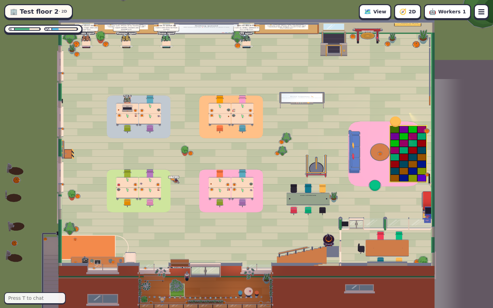
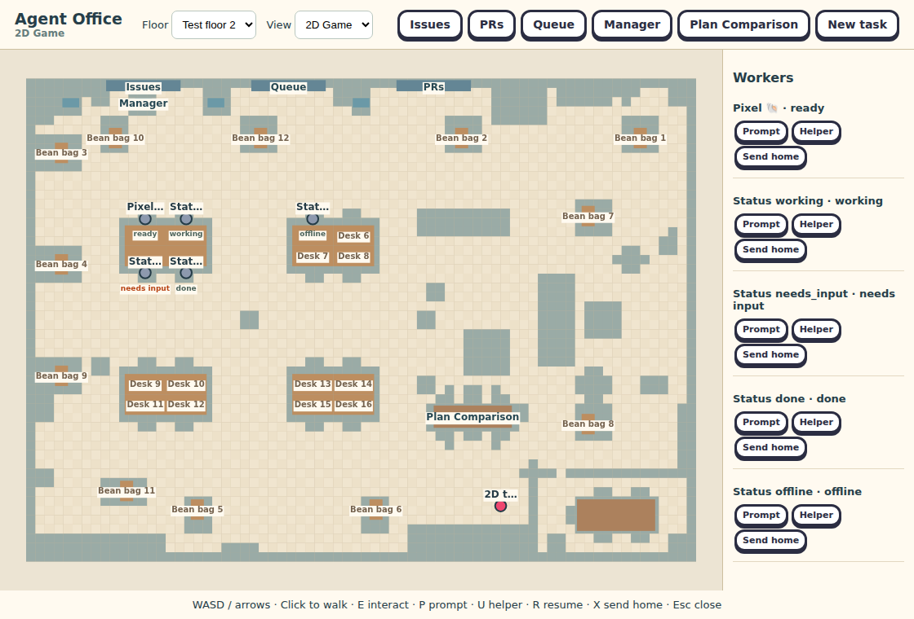
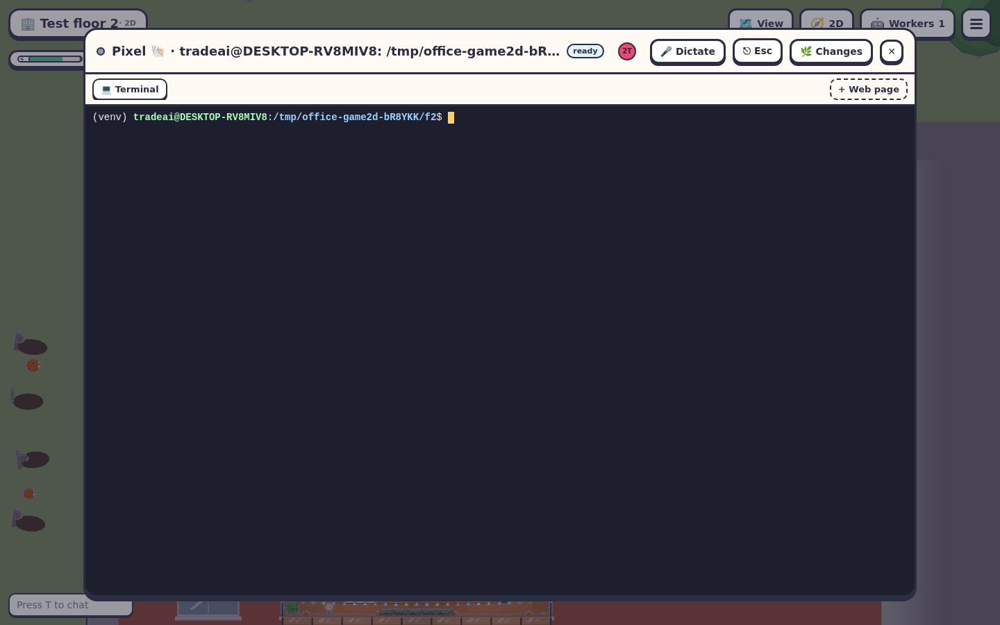
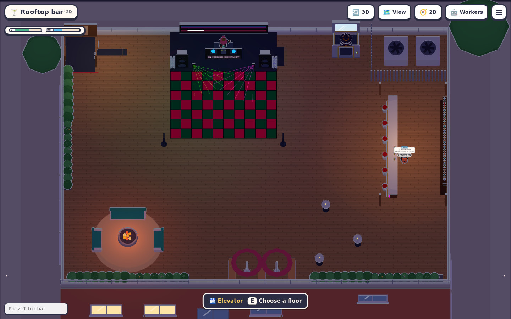
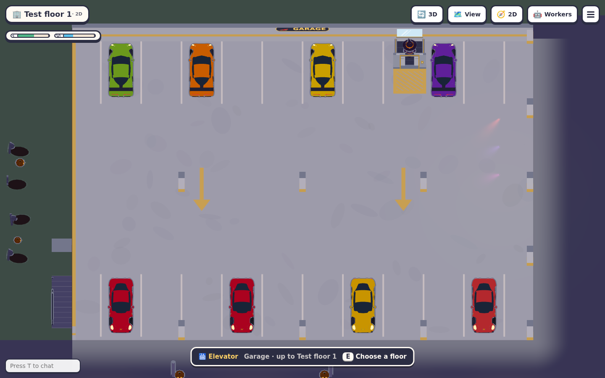
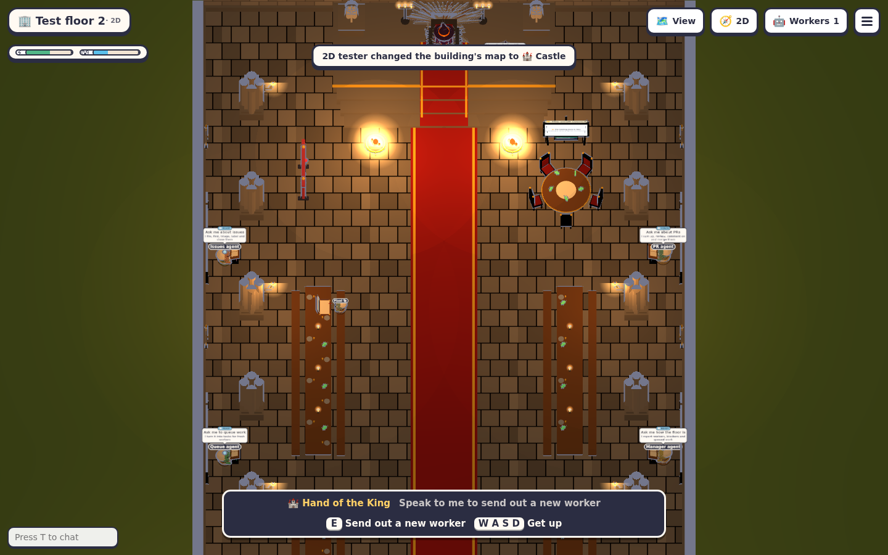
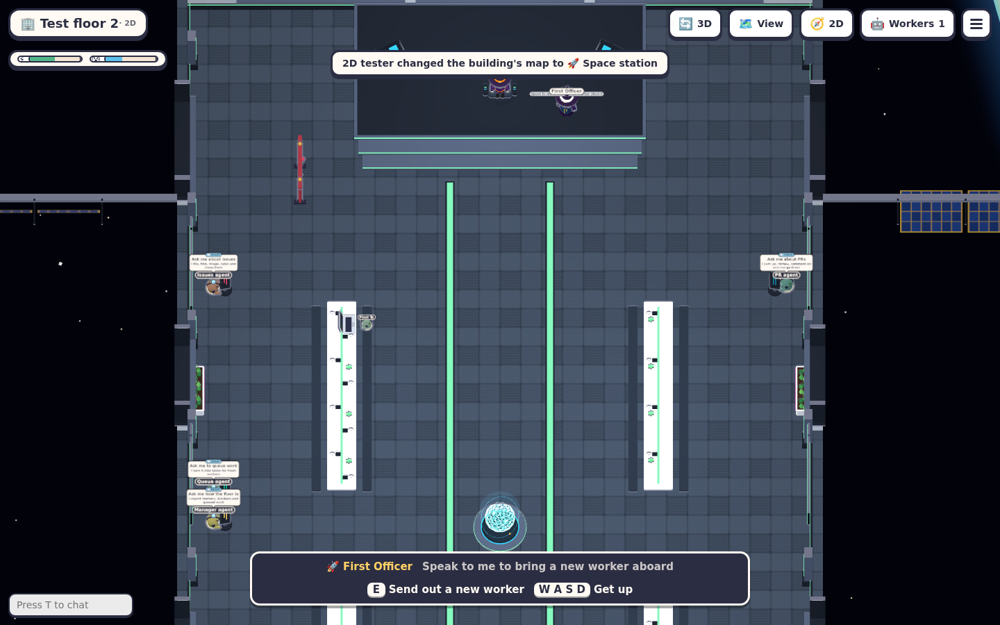
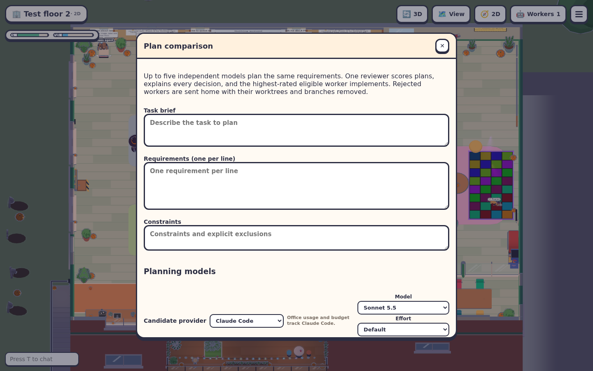
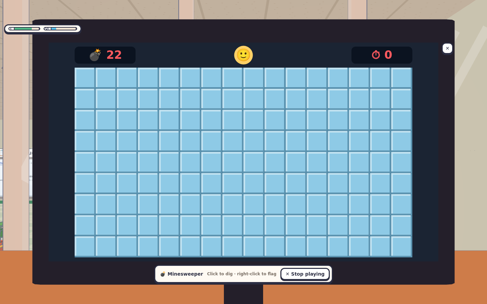
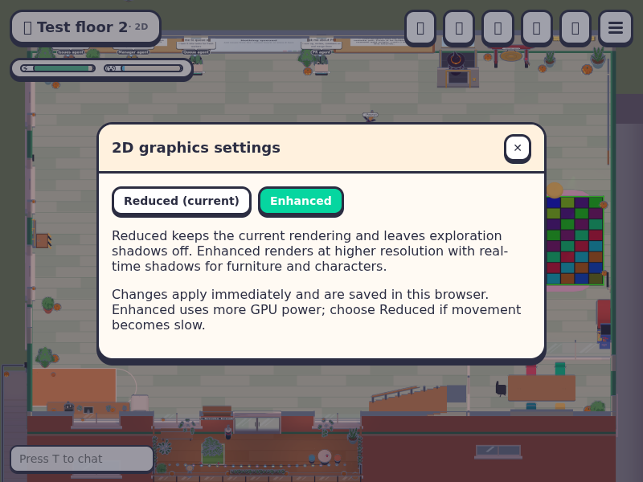

# Complete 2D view verification

The `/2d` entry loads the same office composition and feature registries as 3D. Exploration uses an orthographic cutaway camera; activities retain their existing aiming cameras and return to the map afterward. Lite remains a separate lightweight client.

The headless harness runs against its own isolated server, temporary Git project floors and a real shell worker, without connecting to the live office.

```sh
npm run typecheck
npm test -- --test-concurrency=1
npm run build
node --import tsx scripts/e2e-game2d.mjs
```

Typecheck and build passed. All **976 tests** passed, including size, structure, camera projection and raycasting checks. All **19 browser check groups** passed with no page errors:

- **authentication and shared bootstrap**: Protected aliases return through login to /2d; complete office composition connects once on the requested floor.
- **physical elevator and floor management**: Approach/E opens the existing elevator with floor status, add/remove project actions, rooftop and garage; actual rides switch floors.
- **jump camera stability**: Real Space jump lifts the character while camera height and projection remain unchanged.
- **movement and shared collision physics**: Arrows/WASD, ground click-to-walk and collision against the original desk geometry work in the orthographic scene.
- **complete office dialogs**: Shared Issues/PR/Queue, Boss, Smartphone, Services, Whiteboard, Meeting, Search, Settings, view controls and Plan Comparison open from the same menu with close/Esc focus recovery.
- **real arcade interaction**: Boss Control Center launches playable Minesweeper with its original camera and canvas; closing restores the orthographic view and controls.
- **menu and palette recovery**: The full menu and command palette have top-right close buttons and restore controls immediately.
- **shared worker terminal**: Clicking the rendered worker opens the existing terminal and real shell input without a replacement worker/session.
- **office visual and zoom**: Two screenshots show the actual 3D office artwork in a flat cutaway projection, original HUD, elevator and fixtures; wheel zoom updates pointer projection.
- **rooftop game interaction**: The actual shared darts interaction starts its aiming activity on the roof and E returns to the top-down view.
- **real car interaction**: The original car interaction enters the driver, WASD emits real car.drive frames, and E exits back to the plan view.
- **rooftop and garage access**: Real elevator rides reach the full rooftop/bar/game fixtures and garage/car fixtures, then return to the selected office floor.
- **other maps**: Castle and Station load and stay playable through the existing map.set server API; returns to Office without changing worker/session IDs.
- **real golf interaction**: The shared tee interaction starts golf with its original aiming camera; E puts the club away and restores the plan view.
- **activity camera and registries**: Golf, cars, bar games, arcade and climbing use the original shared activity modules; camera ownership switches to perspective and back without another session.
- **multiplayer**: Two real top-down clients exchange existing peer movement and remove the old peer on disconnect.
- **3D/Lite handoff**: 2D → Lite → 3D → 2D preserves non-default floor and worker/session IDs with no spawn/resume requests.
- **direct view toggle**: Visible HUD buttons switch 2D to 3D and back, preserving floor and worker sessions.
- **browser runtime**: No page errors across Office, rooftop, garage, alternate maps and view switching.

Detailed results are in [checks.json](game2d-evidence/checks.json). Live microphone/screen sharing and every individual recreation submode were not exercised; their implementations are shared with 3D. HTTP test fixtures return 404 for unrelated local-office discovery probes while retaining their request/auth assertions.



















Graphics quality is checked separately with `node --import tsx scripts/e2e-game2d-graphics.mjs` after building. It uses an isolated authenticated office to verify immediate switching, saved preferences, activity rendering, and Esc/✕ controls, and captures both quality modes under `/tmp/agent-office-2d-graphics-evidence`. The harness freezes animation only while taking screenshots so software rendering can drain its GPU queue.

The live 2D/3D toggle is checked with `npm run build && npm run e2e:live-view-toggle`. It presses **Y** in a real authenticated office and checks that switching both ways keeps the same context, the same open socket, the player's position, the floor and session, and a seated worker; that a held key, typing in a field and an open dialog do not toggle it; and that `/?3d=1` loads the 3D view ready to toggle. It writes its screenshots and `checks.json` under `/tmp/agent-office-2d-graphics-evidence` (override with `GAME2D_ARTIFACTS`).


