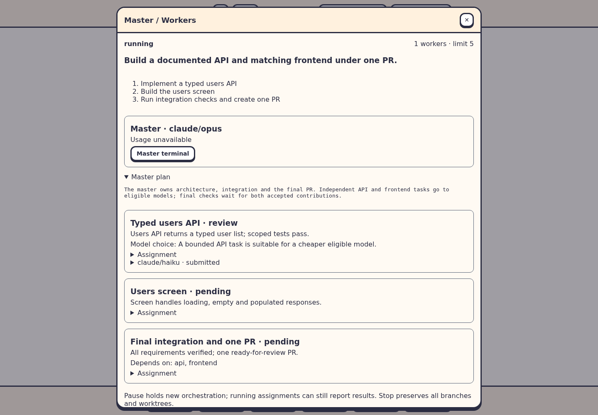
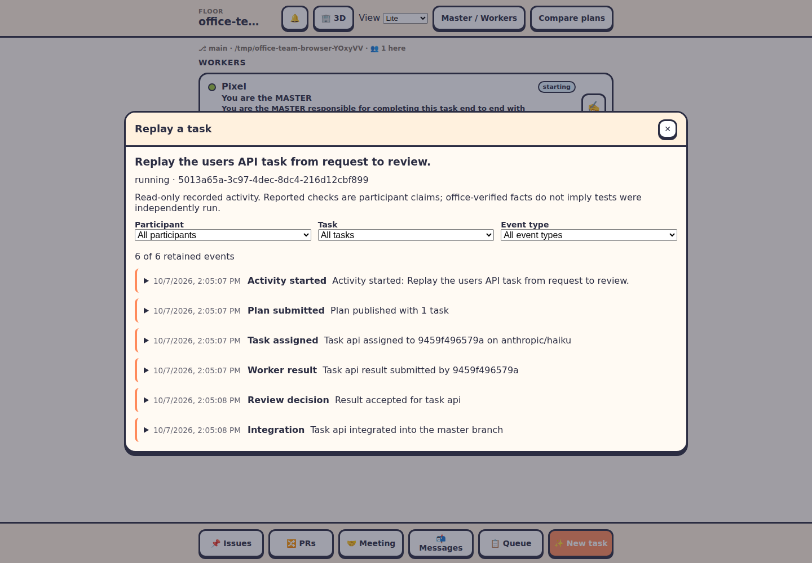

# Master / Workers

Open **Master / Workers** in the Lite header, the 3D/2D game menu, or the command palette. This is a separate activity from plan comparison: one master completes your task with a team rather than competing against other planners. It requires a local Git floor and installed, signed-in coding agent CLIs.

Choose an explicit provider/model/effort for the master, add the models it may hire, and choose a worker limit of 1–5 (default 5). The master is additional to that limit, and everyone counts toward existing office capacity. Eligible models may be reused across workers. The master infers suitability from the task and model identities and records its reasoning; model names do not guarantee capability. All eight built-in providers are supported. Custom shell agents are excluded.

Give the activity a task brief, requirements, and constraints. It starts automatically: the master inspects the repository, publishes its plan and task graph, delegates suitable independent tasks, contributes its own work, reviews results, integrates changes, verifies the final branch, and creates one ready-for-review PR. No plan approval step is required. Repository instructions and provider permission prompts still apply.



## Presets

Save a named team preset to avoid selecting models every time. A preset includes the master, eligible model pool and worker limit; each run gets a new brief, requirements and constraints. Load a preset, change the configuration or name, and use **Save preset** to update it. **Save as new** duplicates it under a new ID; **Delete preset** removes it. Presets are shared in this office, survive restarts, and are available across browsers. Existing runs retain their original settings when a preset changes.

## Tasks, branches and responsibility

The master is responsible for the outcome. Its plan defines instructions, acceptance conditions, expected files and dependencies for each task. A dependent task cannot start until its prerequisites are accepted and integrated. The activity shows assignments, model-selection reasons, result evidence, worker terminals and the final PR.

The master has its own integration branch/worktree. Every worker has an isolated branch/worktree starting from the master's committed state at assignment time. Workers make local commits and submit results; they do not push branches or create PRs. The master inspects actual diffs and checks, merges accepted commit heads preserving ancestry, resolves conflicts, and records acceptance. Inbox delivery, acknowledgment and a worker's completion claim alone do not complete a task. For research-only tasks, results can have no commits.

Idle workers may be reused after their clean branch can fast-forward to the master's latest commit. Otherwise an idle participant can be retired with its checkout and branch preserved to free a seat. The team limit bounds currently hired workers; historical attempts remain visible.

A failed or rejected assignment gets at most one retry, using a different eligible model. If no suitable alternative exists, or that attempt fails, the master does the task itself. A worker that stops without submitting a result counts as a failed attempt. A worker needing input notifies the master; the master can inspect its blocker and cancel the assignment while preserving its work, then retry or take over. User authorization is still needed for provider permission requests that cannot be resolved through an authorized alternative.

The master records a ready completion checklist with the final commit and PR URL. Finalization checks that every task is done, the integration checkout is clean, the final commit was pushed, and exactly one open, non-draft PR belongs to the master's branch. Known failed PR checks block finalization. Pending CI remains visible on the PR; checklist evidence is model-reported, not proof independently established by the office. The activity ends at the verified open PR. It does not merge or monitor later review comments.

## Coordination and recovery

The mode reuses tracked worker inboxes for questions and handoffs. Structured task state is stored separately. Coordinator notices wait for idle/done terminals, so they do not interrupt running tools. The master can end a turn while awaiting worker results; a queued update continues it when it becomes available. Needs-input sessions remain visible for inspection. CLI/provider lifecycle reporting and agent compliance determine how promptly a participant handles its notices.

**Pause** holds new orchestration; already running assignments can still submit results. **Resume** reconciles the master and assigned workers with their existing branches and sessions. **Stop (keep all work)** stops the activity's terminals and preserves branches, worktrees and results. After success, **Close team terminals (keep work)** frees seats without discarding the completed result. Closing the window by ✕ or Esc leaves the activity running and restores player controls.

After an office restart, an unfinished activity starts paused. Resume explicitly after inspecting its status. Missing integration worktrees and unavailable master sessions are reported; the office does not silently replace the integration checkout. Task attempts, accepted integrations and PRs are retained rather than replayed. Corrupt activity or preset files are reported and are not overwritten automatically.

Activity state lives in each floor's `.agent-office/master-workers.json`; the latest ten previous activities are retained. Shared presets live in the office data directory's `master-workers-presets.json`. Files are saved atomically with owner-only permissions. Stop preserves unintegrated work; removing old worktrees remains a separate user action.

## Replay a task

Choose **Replay** in the activity window for the current activity or one of the retained previous activities. The same read-only timeline is available in Lite, 2D and 3D, including while participants are working. Filter by participant, task and event type, then expand an event to inspect its available instructions, messages, result evidence, review reasons, commits, checks and PR link. Close Replay with its top-right ✕ or Esc to return to the appropriate game controls.



New activities record start, plan submission, assignment, worker result, blocker, retry, review decision, integration, pause/resume, stop and final PR events. Events carry stable IDs, recorded timestamps, activity IDs and applicable participant/task references. Viewing the timeline does not rerun agents, execute recorded commands, modify branches or make model calls. Existing floor access and participant authorization rules continue to apply.

Worker and master check claims are labeled **reported**. The office can independently establish integration ancestry and final PR validation; those facts do not mean it independently ran the reported test commands. Missing evidence, older activities without event recording, and omitted history are shown explicitly rather than reconstructed with invented timestamps.

Replay events persist with activity state across restarts. Each activity retains its latest 500 events; older events are removed with a visible dropped count. The current activity and latest ten previous activities share the existing activity retention policy. Each recorded text field is limited to 4,000 characters and arrays are bounded. Replay stores structured activity evidence, excluding full terminal recordings and keystrokes; credential and environment assignment patterns in recorded text are redacted. Keep secrets out of activity briefs and evidence, which are also part of existing activity state. Atomic persistence and paused recovery remain unchanged. Repeated recovery and repeated submissions do not replay agent work or duplicate the same recorded transition.

## CLI and MCP

In `agent-office tui`, press `:` and use:

```text
teams                         View activity and preset IDs
team-start /path/to/task.json  Start a configured task
team-pause                    Pause new orchestration
team-resume                   Reconcile and resume
team-stop                     Stop terminals, preserve all work
team-preset /path/preset.json  Create or edit a named preset by ID
team-preset-delete PRESET_ID   Delete a preset
attach WORKER_ID               Open a participant's terminal
```

Example task JSON:

```json
{
  "master": { "provider": "claude", "model": "opus" },
  "models": [
    { "provider": "claude", "model": "haiku" },
    { "provider": "codex", "model": "gpt-5.4-mini" }
  ],
  "maxWorkers": 5,
  "brief": "Build a users API and matching screen under one PR.",
  "requirements": ["Implement a typed users API", "Build the users screen", "Verify integration"],
  "constraints": "Use existing modules; no new runtime dependencies."
}
```

Choose actual models available through your installed CLIs. A preset JSON contains `id`, `name`, `master`, `models` and `maxWorkers`.

Participants get `team_state` and `team_action` through the office MCP server. The prompt also includes the absolute path to `bin/office-team.js` for providers without native MCP:

```sh
node /path/to/bin/office-team.js --help  # full tool schemas
node /path/to/bin/office-team.js state
node /path/to/bin/office-team.js action <<'JSON'
{"action":"result","id":"ACTIVITY_ID","revision":4,"task":"api","summary":"Implemented the API","commits":["COMMIT_HASH"],"checks":"Scoped tests passed"}
JSON
```

Read state for the current ID and revision before each action. Stale revisions reject without repeating the operation. Master actions: `plan`, `dispatch`, `cancel`, `review`, `takeover`, `finish`. Workers may submit only their own assigned `result`, including `failed: true` for blockers. The server verifies participant identity, role, allowed models, dependencies, attempts and integration ancestry. Existing request/inbox/reply/ack tools remain available. Team participants cannot use ordinary office hiring, helpers, queue management or PR registration APIs; the master uses the dedicated team actions.

These API restrictions are not a sandbox against arbitrary shell commands, external plugins, human terminal input or someone controlling the machine. Use trusted executables. Workers are instructed to follow their assigned scope and leave PR creation to the master.

## Usage and future budgets

Choose eligible models according to your budget. V1 does not infer prices, automatically select the cheapest model, or enforce a new team dollar limit. Available provider token/cost reports are displayed; missing and partial data remain explicit. Existing office-wide hiring limits and budget pauses still apply.

The coordinator has an optional policy hook before dispatch for future budget enforcement, and retains participant usage snapshots before retirement. No hard spending limit is implied by the displayed estimates.

## Verification

Run `npm run typecheck`, `npm test`, and `npm run build`. Then run `node --import tsx scripts/e2e-master-workers.mjs` with installed Chromium under `~/.cache/ms-playwright` or `CHROMIUM_PATH`. Browser screenshots and checks are saved to `/tmp/agent-office-master-workers-evidence` (override with `TEAM_ARTIFACTS`). The harness uses an isolated office and fake agent sessions, not paid model calls; game focus checks suppress GPU scene drawing while exercising the real modal/player controls. The real-server test exercises a mixed Claude/Codex roster, actual Git worktrees and commits, API restrictions and final PR verification against a fake forge.

Run `node --import tsx scripts/e2e-task-replay.mjs` for Replay browser checks and screenshots in `/tmp/agent-office-task-replay-evidence` (override with `REPLAY_ARTIFACTS`). This also uses fake agent sessions without paid model calls.

For a live provider smoke test, load a small existing repository, select installed authenticated models, and ask for two independent small changes plus tests. Confirm each worker submits local commits, the master integrates them, the required checks pass, and only the master creates a PR. Live model behavior remains subject to provider availability and permissions.
