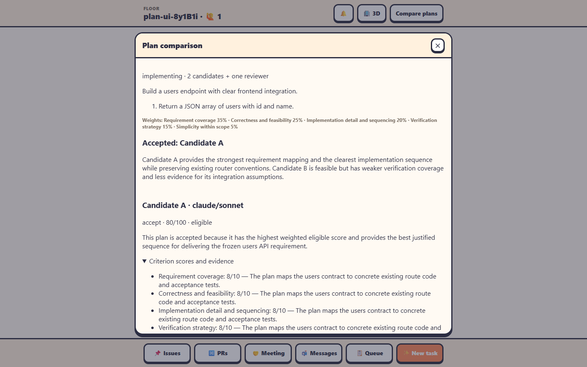

# Independent plan comparison

Use **Compare plans** in the lite header, the 3D menu or command palette, or the separate six-seat table beside the office's desks. This is a separate activity from meetings: candidates have independent Git worktrees and cannot read other plans through the office tools. The activity requires a local Git project and the **Office** map. Close its activity before switching to another map.

Choose one to five candidates with distinct explicit models and one reviewer. Each candidate receives the same brief, numbered requirements, constraints and fixed review weights. Set requirements one per line. All participants count toward the office's worker limit, so five candidates need six free worker slots. The reviewer may use the same model as a candidate.

Candidates and reviewers support every provider offered by the office: **Claude Code, OpenCode 1.x, Codex, Grok, Muse Code, DeepSeek Harness, Pi and Cursor**. Install and sign in to each selected CLI on the office machine first. Provider/model/effort controls use the same catalogues and validation as hiring. Choose explicit models for native providers. Custom `--agent` commands have no selectable model or standardized prompt interface, so they are not offered at this table. Candidate provider/model pairs must be distinct, including equivalent Claude/OpenCode aliases. Identical local model IDs on different CLIs are allowed, since they can resolve differently. OpenCode 2.x remains refused because its permission and plugin APIs differ.

All planning workers get independent worktrees, plan-only instructions and authenticated role-scoped office tools. Claude retains its restricted builtin tool list and strict MCP configuration; OpenCode uses its built-in Plan agent and the office plugin guard; Codex uses its read-only sandbox and office MCP; Cursor starts in its native Plan mode. Pi, Grok, Muse and DeepSeek Harness use the CLI bridge described below. For those bridge providers, repository read-only behavior is instructed rather than enforced by a tool allowlist; their own CLI permissions still apply. Only select trusted executables and plugins. Office management operations are denied to every locked participant regardless of provider. Office-wide launch arguments are omitted during planning. These controls are not a security boundary against someone controlling the machine, terminal, agent executable or plugins. The reviewer sees anonymous labels through the activity tool; blind review is best-effort, not identity secrecy from filesystem inspection.

## Plan tools for every CLI

Agents without an office MCP connection receive the absolute command for `bin/office-plan.js` in their prompt. Run `node /path/to/bin/office-plan.js --help` for the JSON schemas allowed for your role. Read state with `plan_review_state`; pipe the full argument JSON into `submit_candidate_plan` (candidate), `request_plan_clarification` or `submit_plan_review` (reviewer). Submit using stdin, without creating files. The bridge inherits the worker’s existing identity and token and enforces the same role checks as MCP. Candidate plans, reviews, clarification, cleanup and winner promotion follow the same lifecycle for every provider.

## OpenCode Zen free-model errors

The error `OpenCode's free tier can only be used from within OpenCode` can occur inside the official OpenCode CLI, particularly with custom primary agents or disabled shell tools ([upstream report](https://github.com/anomalyco/opencode/issues/50081), [permission report](https://github.com/anomalyco/opencode/issues/50627)). Planning uses OpenCode's native Plan agent while retaining the office plugin's strict read/plan-tool guard. Shell permission remains `ask` to keep OpenCode's native tool schema, but the plugin rejects every shell invocation even when permission is approved. This avoids the custom `office_plan` launch configuration; it does not override provider authentication or guarantee free-model availability. A separate error has also been reported in official OpenCode 1.18.34 ([upstream issue](https://github.com/anomalyco/opencode/issues/52907)). If the error persists, connect a provider using your own credentials and choose an authorized model, then stop/clean the failed comparison and start again. Existing sessions retain their original configuration until restarted.

## Detailed plans and review

Each candidate must submit a structured plan through **submit_candidate_plan**. Printed terminal text alone is not a submission. Required content:

- A mapping for every numbered requirement: proposed approach and acceptance conditions.
- Existing repository findings with filenames and supporting evidence.
- A detailed design covering interfaces, data flow and failure handling.
- At least two ordered implementation steps, each with files and concrete details.
- Verification covering every requirement, with checks and expected outcomes.
- Risks and mitigations, assumptions and how to verify them, and included/excluded scope.

The server checks structure, coverage IDs, minimum detail lengths and size limits; the reviewer assesses quality and verifies claims against the repository. Plans are limited to 60,000 characters. Submitted plans are frozen unless the reviewer requests a clarification.

Default weights total 100 and are fixed when the activity begins:

| Criterion | Weight |
| --- | ---: |
| Requirement coverage | 35 |
| Correctness and feasibility | 25 |
| Implementation detail and sequencing | 20 |
| Verification strategy | 15 |
| Simplicity within scope | 5 |

You can adjust these weights before starting. The reviewer assigns 0–10 for each criterion and supplies supporting reasons, strengths and weaknesses. Coverage, feasibility and detail also have mandatory pass/fail gates. A high raw score cannot override a failed gate. Missing plans receive zero and fail all gates. Unanswered requested clarifications fail the detail gate.

One clarification round is available before the final review. Candidates then submit complete revised plans; both the original and revised versions remain saved. Clarifications cannot change the frozen requirements or award a candidate new scope. A candidate has the configured time to plan (20 minutes by default, 1–120 allowed); clarification time is capped at 10 minutes. Review has its own round deadline. The office prompts the reviewer once its terminal becomes ready; if it is waiting for permission or offline, use its terminal or resume it. Reviewer timeout stops the activity without selecting an implementation.

The server computes `sum(criterion score × weight / 10)` and rounds the weighted total to two decimals before ranking. The highest-rated eligible plan wins automatically. Ties use coverage, then feasibility, then alphabetical candidate label. An inconsistent winner or acceptance decision is rejected before cleanup. No eligible plan means everyone is rejected and no implementation starts.

The reviewer must provide an overall comparison summary and a specific acceptance/rejection explanation for every candidate. The office displays these reasons alongside scores and complete plans. Review is a model's assessment; the office validates the ranking and workflow, not the truth of every claim.

## Selection, cleanup and implementation

All plans and the final decision are saved before rejected workers are sent home. Cleanup targets only this activity's rejected candidates and removes their worktrees and branches. Their submitted plans and reviews remain available. If cleanup fails, implementation waits and the UI shows the error; use **Retry cleanup** or `plan-retry`. An unrelated worker is not part of this cleanup.

The winner keeps its model and worktree and starts a fresh conversation with implementation permissions, the original requirements, frozen accepted plan and reviewer decision. It follows the ordinary completion-checklist workflow. Selection does not automatically create or publish a PR, or authorize publishing to an upstream repository. Follow the project's explicit repository rules.

The reviewer stays at the table so you can inspect its reasoning. **Stop and clean activity** removes planning participants. Once implementation has started, **Close activity (keep winning work)** stops the winning terminal and preserves its checkout and branch; it also removes the reviewer. Closing a browser modal or pressing Esc simply returns to the office and leaves the activity running. From an attached TUI worker terminal, **Ctrl+]** detaches safely.

State survives office restarts in `.agent-office/plan-review.json`. Complete activity artifacts are retained in `.agent-office/plan-reviews/<activity-id>/activity.json` and `review.md`; the UI retains the latest ten earlier activities. Replaying a saved verdict does not restart an already promoted implementation. Corrupt activity state is reported and blocks a new activity until recovered rather than silently replacing history. Interrupted startup is reported; stop that activity to clean its partial roster before retrying.

## Terminal dashboard

Connect with `agent-office tui`, press `:`, then use:

```text
plans                         View plans, scores, decisions and worker IDs
plan-start /path/to/task.json  Start the activity described by a JSON file
plan-stop                     Stop/close the activity and clean its participants
plan-retry                    Retry blocked cleanup
attach <worker-id>            Open a candidate or reviewer terminal
```

`plan-start` accepts a local JSON file (no additional flags). Example:

```json
{
  "brief": "Build a users API endpoint with a documented frontend contract.",
  "requirements": [
    "Return a JSON array of users with id and name.",
    "Add integration tests for an empty result and authentication behavior."
  ],
  "constraints": "Reuse the existing router; no new dependencies or user write endpoints.",
  "candidates": [
    { "provider": "claude", "model": "sonnet" },
    { "provider": "claude", "model": "haiku" }
  ],
  "reviewer": { "provider": "claude", "model": "opus" },
  "minutes": 20,
  "weights": { "coverage": 35, "feasibility": 25, "detail": 20, "verification": 15, "simplicity": 5 }
}
```

MCP tools: candidates get `plan_review_state` and `submit_candidate_plan`; the reviewer gets `plan_review_state`, `request_plan_clarification` and `submit_plan_review`. Tool schemas describe the full JSON fields. Submissions include the current activity ID and revision returned by state. Authenticated planning participants cannot hire, send home, prompt other workers, use inboxes, request helpers or submit completion checklists through the worker API. The winner receives normal tools after promotion.


